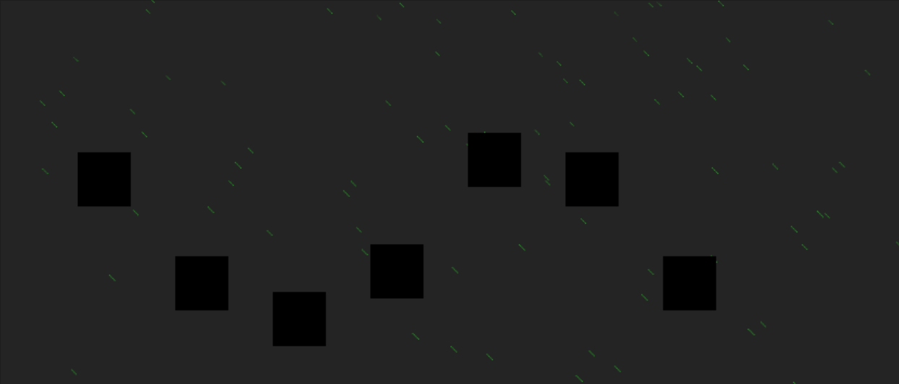

This repo contains a demo game and examples of simple scenes created using the Phaser3 framework and Csound. Provided below is an overview of different aspects of the game development, from simple sprite movements to object collision. 

## Getting started: Loading Phaser3 and Csound
 
Phaser3 is a framework for generating Javascript based games. Csound-WASM is a web assembly version of the now well established audio programming language Csound. The two libraries need to be loaded before calling any game scripts. The loading of the library scripts happens in the game.html file, before any other scripts are called:

```html
<!doctype html> 
<html lang="en"> 
<head> 
    <meta charset="UTF-8" />
    <title>Game</title>
    <script src="//cdn.jsdelivr.net/npm/phaser@3.15.0/dist/phaser.js"></script>
    <script src="csound-wasm-browser.js"></script>
    <script src="csound.js"></script>
    <script src="game.js"></script>
    <link rel="stylesheet" type="text/css" href="style.css"> -->
</head>
<body>
</body>
</html>
```
* Note that the demos presented here use a forked version of WebCsound available through [this](https://github.com/hlolli/csound-wasm) repo. It works just the same as the official Csound-WASM, but is provided as a single JS file rather a collection of different scripts.  

A 'csd.js' script is called just after Csound-WASM_Browser is called. It will compile our Csound orchestra.

```javascript
const csd = `
<CsoundSynthesizer>
<CsInstruments>
ksmps = 512

;jumping sound
instr 1
    a1 expon 1, p3, 0.001
    a2 oscili a1, (1-a1)*p4+p5
    outs a2, a2 
endin

</CsInstruments>
<CsScore>
f0 z
</CsScore>
</CsoundSynthesizer>
`
csound.playCSD(csd);
```

Csound will start running as soon as the game loads. It will then wait for events from the game engine before it does anything. 


## Creating a scene. 

Scenes are created in Phaser3 by creating a new `Phaser.Scene` object. Below is code for a barebones scene.

```javascript
class GameScene extends Phaser.Scene {

    constructor (config)
    {
        super(config);
    }

    preload ()
    {
    }

    create ()
    {
    }

    update ()
    {
    }
};

var config = {
    type: Phaser.CANVAS,
    width: 960,
    height: 600,
    backgroundColor: 'rgb(255, 255, 255)',
    physics: {
        default: 'arcade',
        arcade: {
            gravity: { y: 300 },
            debug: false
        }
    },
    scene: GameScene
};


var game = new Phaser.Game(config);

</script>
```

The first line of code declares a new class called `GameScene` which extends the `Phaser.Scene` namespace. The constructor is passed a JSON configuration var that sets various game properties. It sets the physics engine to arcade, and gravity to 300. The type field sets which system is used for displaying the graphics. It defaults to WebGL, but you can also set it to use the HTML5 Canvas.

## The preload function

The preload function will load all assets needed for the game, including audio. The `load.image()` method can be used to load any sprites needed by the scene, while `load.spritesheet()` loads multiple frames from an sprite sheet.  

```html
(...)
preload ()
{
    this.load.spritesheet('spike', 'assets/spike.png', { frameWidth: 39, frameHeight: 48 });
    this.load.image('ground', 'assets/platform.png');
}
(...)
```

The assets folder in this case is located in the same directory as the game itself. `spike.png` is a sprite-sheet that contains 9 frames of Spike in various walking positions and directions. `platformBrick.png` is a plain black cube that is used as a platform for the player to walk on. As this only contains one image, it can be loaded as an image rather than a sprite sheet.  


`spike` is the name of the sprite, and is used later when we need to access it. When loading sprite sheets you can should specify the frame dimensions. How to animate these sprite will be covered later in this text.


## The create() function. 

The create function is used to create all of our game objects. For example, Spike will be created here by creating a new physics sprite. 

```javascript
create ()
{
    this.player = this.physics.add.sprite(100, 10, 'spike');
    this.player.displayHeight = 45;
    this.player.setBounce(.1);  
}
``` 
A physics sprite can have different properties set to control how it behaves. X and Y coordinates are passed to the `physics.add.sprite()` function, along with the sprite name. `setBounce(.1)` gives Spike a little pep in his step by adding a slight bounce when he moves. 

Running the game now will show Spike fall from the sky and continue falling until he disappears. 


#### Platforms

Spike needs somewhere to land when he falls from the sky. Each platform will form part of a static group of objects. The `physcis.add.staticGroup()` function will add game objects to a static group. A simple `for` loop is then used to place platforms across the entire scene.

```javascript
create()
{
    this.player = this.physics.add.sprite(100, 10, 'spike');
    this.player.displayHeight = 45;
    this.player.setBounce(.1);  
    this.platforms = this.physics.add.staticGroup();

    for( var i = 0 ; i < 10 ; i++)
        this.platforms.create(48*i, 400, 'platform').refreshBody();
}
```


#### Collisions 

Although there are now platforms in the scene, Spike will continue to fall through them until a collision callback is created. This is done through the `Physics.add.collider()` function. In this case a collider is created that will check for collisions between the player and the platforms.

```javascript
create()
{
    this.player = this.physics.add.sprite(100, 10, 'spike');
    this.player.displayHeight = 45;
    this.player.setBounce(.1);  
    this.platforms = this.physics.add.staticGroup();
    
    for( var i = 0 ; i < 10 ; i++)
        this.platforms.create(48*i, 400, 'platform').refreshBody();

    this.physics.add.collider(this.player, this.platforms);
}
```


#### Building a level

The create function for the demo game includes a simple level editor that is based on ideas presented in [this](http://www.lessmilk.com/tutorial/2d-platformer-phaser) tutorial. A main level is built using a simple string array. Each string in the array represents a row in the scene. Each character within that string creates a particular type of platform. A simple loop in the create function can read through the array and create all the platforms one needs. The following level string be used to create an array of platforms across the screen.

```javascript
    create()
    {
        (...)
        var mainLevel = [
                '                 ',
                '                 ',
                '                 ',
                '             xxxx',
                'xx               ',
                '                 ',
                '          xxxxxxx',
                '                 ',
                '        xxxxxxxxx',
                '                 ',
                'xxxxxxxxxxxxxxxxx'
        ];
        
        var width = mainLevel[0].length*48;
        var height = (mainLevel.length)*48;

        for (var y = 0; y < mainLevel.length; y++) {
            for (var x = 0; x < mainLevel[y].length; x++) {
                if (mainLevel[y][x] == 'x') {
                    this.platforms.create(48*x, 48*y, 'platform').refreshBody();
                }
            }
        }

        this.keys = this.input.keyboard.addKeys('W,S,A,D,B');

    }
```
You might notice an extra line of code at the bottom. This is use to set the keyboard mappings. Here the characters W,S,A,D are added. They can be queried later in the `update()` function.

#### Animations

Finally, it's time to add the animations for the main character. `this.anims.create()` will create animations, based on a range of frames from an asset. In this case 'turning' uses just a single frame, while walking 'left' and 'right' use a range of frames. 


```javascript
create()
{
    (...)
    this.anims.create({
        key: 'left',
        frames: this.anims.generateFrameNumbers('spike', { start: 0, end: 3 }),
        frameRate: 10,
        repeat: -1
    });

    this.anims.create({
        key: 'turn',
        frames: [ { key: 'spike', frame: 4 } ],
        frameRate: 20
    });

    this.anims.create({
        key: 'right',
        frames: this.anims.generateFrameNumbers('spike', { start: 5, end: 8 }),
        frameRate: 10,
        repeat: -1
    });
}
```

## The update function

The update function is where the game is brought to life. This function runs repeatedly to constantly update our game world. It is here that one handles text input from the keyboard.   

```javascript
update ()
{
    if (this.keys.A.isDown){
        this.player.setVelocityX(-160);    
        this.player.anims.play('left', true);
    }
    else if (this.keys.D.isDown){
        this.player.setVelocityX(160);    
        this.player.anims.play('right', true);
    }
    else{
        this.player.setVelocityX(0);    
        this.player.anims.play('turn');
    }
}
```

The `setVelocity()` function sets the velocity that the player will move on each key press. In order to make Spike jump, one must push him upwards by setting his y gravity to a large number. The y velocity is also increased in order to bring Spike down to earth quickly. 

```javascript
update()
{
    (...)
    if (this.keys.W.isDown && this.player.body.touching.down){
        this.player.setVelocityY(-540);
        this.player.setGravityY(1040);
    }
}
```
<a href="update.html" target="_blank">Example</a>


#### Adding some sounds: Score events

Now that Spike can interact with the scene, it might be good to test out some sound design ideas. Sending events to Csound is trivial and can be done in 2 ways. The first mechanism is a score event, which can be sent using the `csound.inputMessage()` function. In the following example, a score message is sent to Csound each time the users jumps.

```javascript
update()
{
    (...)
        if (this.keys.W.isDown && this.player.body.touching.down){
            csound.inputMessage("i1 0 .1 1000 500");
            this.player.setVelocityY(-540);
            this.player.setGravityY(1040);
            this.stickToPlatform = false;
        }
    (...)
```

The Csound instrument being called is defined in the `csd.js` file, which looks like this.

```html
const csd = `
<CsoundSynthesizer>
<CsInstruments>

;jumping sound
instr 1
    a1 expon 1, p3, 0.001
    a2 oscili a1, (1-a1)*p4+p5
    outs a2, a2 
endin

</CsInstruments>
<CsScore>
f0 z
</CsScore>
</CsoundSynthesizer>
`
csound.playCSD(csd);
```

<a href="updateSounds1.html" target="_blank">Example</a>


`instr 1` 1 takes two p-field parameters which are sent via the `csound.inputMessage("i1 0 .1 1000 500")` function. These number can be changed on the javascript side at any point in the game to change to parameters of the sounds. In the following code Spike's x position within the world determines the pitch of the tone played. 

```javascript
update()
{
    (...)
        if (this.keys.W.isDown && this.player.body.touching.down){
            csound.inputMessage("i1 0 .1 1000 " + this.player.x.toString());
            this.player.setVelocityY(-540);
            this.player.setGravityY(1040);
            this.stickToPlatform = false;
        }
    (...)
```
<a href="updateSounds2.html" target="_blank">Example</a>


## A bad night

The main character of this game is stuck in a maze of blocks that he needs to clear in order to find the yellow door. Some bad weather should help add to the bleakness of Spike's challenge. Lightning is created via a callback function that randomly triggers itself. Each time it is called it instructs the scene to repeatedly redraw its background colour. Once it has updated the background colour 20 times it will return to the original background colour. 

```javascript
constructor (config)
{
    (...)
    this.normalColour = new Phaser.Display.Color(60, 60, 60);
    this.colour1 = new Phaser.Display.Color(155, 155, 155);
    this.colour2 = new Phaser.Display.Color(0, 0, 0);
    (...)
}

triggerLightning ()
{
    this.timedEvent1.reset({ delay: Phaser.Math.Between(2000,15000), callback: this.triggerLightning, callbackScope: this, repeat: 1});
    this.lightningTime = 0;
}

showLightning()
{
    if(this.lightningTime<20){
        var hexColour = Phaser.Display.Color.Interpolate.ColorWithColor(this.colour1, this.colour2, Phaser.Math.FloatBetween(0, 10), Phaser.Math.FloatBetween(0, 10));
        this.cameras.main.setBackgroundColor(hexColour);
        this.lightningTime++;
    }
    else
        this.cameras.main.setBackgroundColor(this.normalColour);
}
```


Rain can be created using the particle emitter, which comes with many different parameters for setting all aspects of how the particle are emitted. In this case we set the x range to vary between 0 and 1800. Gravity is set to 100 to pull the rain down the screen, while the raindrops themselves will get a little larger in scale as they fall from the sky.  

```javascript
addRain()
{
    this.rain = this.add.particles('raindrop');
    this.rain.createEmitter({
        x: { min: 1, max: 1800 },
        y: 0,
        lifespan: 1200,
        speedY: { min: 200, max: 400 },
        gravityY: 100,
        gravityX: Phaser.Math.Between(100, 200),
        scale: { start: 0.1, end: 0.2 },
        quantity: 4,
        blendMode: 'ADD'
    });
}
```

<a href="rain.html" target="_blank">Example</a>


#### Adding some sounds: Real-time channels 

There may be times when you want to have a single instrument running all the time. In these cases it is important to able to send data to Csound while it is running. This can be achieved using so-called software channels. String and numeric data can be sent to any running instrument in Csound. The `csound.setControlChannel()` function can be called to send data to Csound from the game engine. 

In order for Csound to pick up this data it needs to call the `chnget` opcode. In the following instrument some noise is filter by Spike's position on the y axis. 

```csound
(...)
instr 2
    a1 rand 1
    a2 lpf18 a1, chnget:k("cutoff"), .5, 0
    printk 1, chnget:k("cutoff")
    outs a2, a2 
endin

(...)
```

The above instrument is triggered to play in the Csound score section just as the game opens. It then waits for data to be sent from the game. The game data is sent using the `csound.setControlChannel()` function. This funtion takes two parameters, a string naming the channel, and the value to send to that channel. In the simple example presented here, Spike's y position will control how much of the noise is filtered. 

The following code is added to the `update()` function:

```javascript
csound.setControlChannel("cutoff", this.player.y*2);
```

The noise will change whenever Spike moves up or down the screen.

<a href="moodSounds1.html" target="_blank">Example</a>


#### Getting information from Csound

Channels can be bi-directional. Csound can just as easily send data to the game as receive it. In this next example a drum beat is used to trigger lightning. An always-on instrument (`instr 3`) is used to trigger a drum sound every second. At the same time it triggers the drum sound it also sends channel data to the 'triggerLights' channel. 

```javascript
instr 3
    kRand randh 1000, 4000, 2
    if metro(1) == 1 then
        event "i", 4, 0, 10
        chnset kRand, "triggerLights"
    endif
endin

instr 4
    prints "Istrument 4"
    a1 expon .1, p3, 0.001
    a2 expon 150, p3, 50
    a3 oscili a1, a2
    outs a3, a3
endin
```

The best way to pick up these message in the game is by using a callback function which is started from the game's `preload()` function. It will be called on each k-rate cycle. It can be declared as follows.

```javascript
preload()
{
    this.load.spritesheet('spike', 'assets/spike.png', { frameWidth: 39, frameHeight: 48 });
    this.load.image('platform', 'assets/platform.png'); 
    
    csound.on("perform", async () => {
        const val = await csound.getControlChannel("triggerLights");
        if (this.triggerLights!=val)
        {
            this.triggerLights = val;
            this.triggerLightning();
        }
    });
}
```

Where `this.triggerLights` is a variable used to hold the current value of the `triggerLights` Csound channel. The Csound instrument is going to send a new random number every second. Each time it changes, the `this.triggerLightning()` function is called, and strikes of lightning appear on the scene. 


<a href="moodSounds2.html" target="_blank">Example</a>


Note that the timed function used to drive the strikes of lightning in the previous example have been disabled in this case. 


## Bad things happen

In the demo game, collisions between certain sprites and the main player result in Spike being cosmically teleported back in time to the start of the level. The bad platforms, or razor grass in this case, is created in the same way as any other platform. In the simple level designer, we use 'g' to denote bad grass.

The demo game also features good grass that can be added as a prop anywhere in the scene. Again they are added in the same way as the other game objects. 

```javascript
create()
{
    (...)
    for (var y = 0; y < mainLevel.length; y++) {
        for (var x = 0; x < mainLevel[y].length; x++) {
            if (mainLevel[y][x] == 'x') {
                this.platforms.create(48*x, 48*y, 'platform').refreshBody();
            }
            else if(mainLevel[y][x] == 'h') {
                this.badGrass.create(48*x, 50*y, 'badGrass').refreshBody();
            }
            else if(mainLevel[y][x] == 'g') {
                this.goodGrass.create(48*x, 48*y, 'goodGrass').refreshBody();
            }
        }
    }
    (...)

```

<a href="razor.html" target="_blank">Example</a>


To reset the game each time Spike wonders into long grass, a collider is set up to observe collisions between Spike and the bad grass. This time a callback function is passed to the collider. This callback function will be called whenever a collision takes place.

```javascript
create()
{
    (...)
    this.physics.add.collider(this.player, this.badGrass, this.badGrassHit, null, this);
    (...)
}

badGrassHit()
{
    //collision between player and bad grass
     this.gameOver();
}
```

The first two parameters passed to `Physics.add.collider()` set the two objects that will be tested for collisions. The next is a callback function that will be called each time a collision takes place. The next parameter gives you a more detailed callback function for testing different types of collisions. It is not needed here so `null` is passed instead. The last parameter is the 'callbackContext'. 

In the demo game, the same type of collision detection is used to collect tokens and bombs, and test for fatal missile attacks. 

Sounds can easily be added to events like this by sending a simple score statement to Csound. In this example a low explosion is heard each time Spikes hits razor grass.

<a href="razorgrassSounds.html" target="_blank">Example</a>


## Cannon fodder

The collision detection shown in the previous section is used to detect when cannon balls hit the player. The cannon balls themselves are creating in a timed callback which creates a sequence of game objects. The cannon balls hits are detected whenever a child cannon ball hits the player.  

```javascript
triggercannonBalls()
{
    this.timedEvent2.reset({ delay: 500, callback: this.triggercannonBalls, callbackScope: this, repeat: 1});
    
    this.cannons.children.iterate(function (child) {
        //  Give each star a slightly different bounce
        var cannonBall = this.cannonBalls.create(child.x, child.y, 'cannonBall').setDisplaySize(8, 8);
        cannonBall.setBounce(1);
        cannonBall.setCollideWorldBounds(true);
        if(child.orientation == 'up')
        cannonBall.setVelocity(this.cannonBallAngle, Phaser.Math.Between(-1000, -600));
        else
        cannonBall.setVelocity(this.cannonBallAngle, Phaser.Math.Between(1000, 600));

        cannonBall.allowGravity = false;
        }, this);
    this.cannonBallAngle = this.cannonBallAngle < 400 ? this.cannonBallAngle + 50 : -400;

}
```


A second collision detector is set up between the cannon ball and the platforms to disable any cannonball that hits a platform.  

<a href="canonSounds.html" target="_blank">Example</a>

## Platforms that move

Tweens provide a simple way of moving game objects around the screen. The demo game features moving platforms which constantly loop between two points. The platforms themselves form part of a physics group. As each object is added to the group, a tween is added to it. 

```javascript
create()
{
    (...)
    this.movingPlatforms = this.physics.add.group();
    (...)
        this.movingPlatforms.create(48*x, 48*y, 'movingPlatform').body.allowGravity = false;
        var movingPlatform = this.movingPlatforms.getChildren()[this.movingPlatforms.getTotalUsed()-1];
        //this.movingPlatforms.getChildren()[this.movingPlatforms.getTotalUsed()-1];
        this.tweens.add({
            targets: movingPlatform,
            x: '+=96',
            delay: 0,
            ease: 'Power1',
            duration: 1000,
            yoyo: true,
            repeat: -1
        });                
    (...)
}
```

The targets field of the tween object sets the sprite to attach the tween to. The `x:'+=96` means the object will move 96 pixel along the x axis before returning at the same speed. The `yoyo` field is set to true to keep the object moving over and back.


A collision detector needs to be created to test if Spike hits the platform. Without this Spike will just fall through the object as shown in the previous gif. The demo game features some logic to help the player move while standing on a platform. And it also features a falling platform that drops as soon as the player lands on it. Check out the source code for further details. 

#### Sound Platforms

There is unlimited scope for interaction with between game events and sound using Phaser3 and Csound. For example, it's not that difficult to build a simple instrument in Csound that can be used to move platforms in the game. The following example is based on the simple update function code presented above. 

In this example the amplitudes of 8 oscillators, which are set randomly, are used to move platforms up and down in the scene. In our k-rate callback function we grab each of the oscillator's current amplitude, and use that to move the platforms up and down. 

``` javascript
instr 6
    k1 oscili 1, .05, -1, .1 
    k2 oscili 1, .05, -1, .2
    k3 oscili 1, .05, -1, .3
    k4 oscili 1, .05, -1, .4 
    k5 oscili 1, .05, -1, .5 
    k6 oscili 1, .05, -1, .6 
    k7 oscili 1, .05, -1, .7 
    k8 oscili 1, .05, -1, .8 

    chnset abs(k1), "platform0"
    chnset abs(k2), "platform1"
    chnset abs(k3), "platform2"
    chnset abs(k4), "platform3"
    chnset abs(k5), "platform4"
    chnset abs(k6), "platform5"
    chnset abs(k7), "platform6"
    chnset abs(k8), "platform7"


    aOut1 oscili k1, 100, 1
    aOut2 oscili k2, 101, 2
    aOut3 oscili k3, 102, 3
    aOut4 oscili k4, 103, 4
    aOut5 oscili k5, 104, 5
    aOut6 oscili k6, 105, 6
    aOut7 oscili k7, 106, 7
    aOut8 oscili k8, 107, 8

    aMix = aOut1+aOut2+aOut3+aOut4+aOut5+aOut6+aOut7+aOut8

    outs aMix*.01, aMix*.01
endin
```

The following code will move each platform based on some channel data from Csound. Note that we only update the platform on every 32nd k-rate cycle. These updates don't need to happen on each frame. Slowing down calls to Csound will improve performance of your game.  

```javascript
create()
{
    for (var x = 0; x < 12; x++)
                this.soundPlatforms.create(90*x, 400, 'platform').refreshBody();

    csound.on("perform", async () => {
        if(this.shouldUpdate>32)
        {
            for( var i = 0 ; i < 12 ; i++)
            {
                const yPos = await csound.getControlChannel('platform' + i.toString());
                var platform = this.soundPlatforms.getChildren()[i];
                platform.y = 200+(yPos*200);
                platform.refreshBody();
            }
        }

        this.shouldUpdate++;
    });
}
```

<a href="platformSounds.html" target="_blank">Example</a>



## The demo

<a href="game.html" target="_blank">The demo</a>

The demo game is in pretty raw state but it does import Csound so it's ready to be hacked; as too are each of the examples presented in the text above. The demo adds a few extra features such collectable stars that came straight out of a phaser tutorial!. The bombs can be used blow up platforms. The goal is to get to the yellow door, which Spike must go through to get to the next level. The code for these things can be found in the githug page. If anyone wishes to contribute a level for the game, I'm more than happy to host it on my github page. 

Note that the web assembly version of Csound runs a little slower than native Csound. Therefore it is important to make your instruments and game run as efficient as possible. The demo game follows standard Phaser3 protocols but is not optimised for performance. More details on how best to optimise graphics can be found at the Html5GameDevs forums. 


## Acknowledgments

Victor, Steven, and Hlöðver Sigurðsson for all the help with the CsoundWASM stuff. In particular hlolli, who showed great patience in answering all my javascript questions. Many codepens and jsfiddle's later, I'm starting to get it. To the developers of Phaser3 and their enormous vault of online examples. And a special thanks to those on who took the time to answer my noobie questions on the HTML5GameDev forums.   